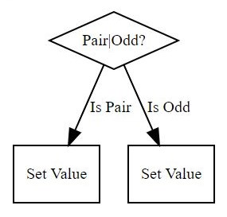

# NFlow
Process Flow Engine for .Net

NFlow allows you to:
* Create business flows in C#
* Do it using a fluent syntax
* Visualize your flows using any Dot Notation viewer 

# How it works
Lets create our Hello World flow.

The following code simply creates a flow that based on the supplied model, evaluates if the values is pair or odd.

**Define a class that will act as your flow model**
```
public class PairOddModel
{
    public int Value { get; set; }
    public String PairOrOdd { get; set; }
}
```
**Define a flow that consumes that model and does something with it**
```
[TestMethod]
public void HelloWorld_PairOrOdd()
{
    var model = new PairOddModel() { Value = 5 };
    var flow = new Flow<PairOddModel>();

    flow.Actions
        .If(ctx => ctx.Model.Value % 2 == 0, a => a.Set(m => m.Model.PairOrOdd = "Pair"), "Pair|Odd?", "Is Pair")
        .Else(a => a.Set(m => m.Model.PairOrOdd = "Odd"), "Is Odd");

    flow.Execute(model);

    Assert.IsTrue(model.PairOrOdd == "Odd");
}
```
Export your flow to Dot Notation to better visualize what's going on
```
var dot = flow.ToDotNotation();
```
The result is a string as follows:
```
digraph G {
compound=true;
"0123276a-6882-424d-9eaa-67377d43cad1" [shape="box" label="Set Value" tooltip="Set Value" fontsize=10 margin=0.05]
"0af8cd10-aa68-477e-9b94-4571d362489b" [shape="box" label="Set Value" tooltip="Set Value" fontsize=10 margin=0.05]
"5dc64b77-c235-40ee-9adf-52aa9d812cfb" [shape="diamond" label="Pair|Odd?" tooltip="Pair|Odd?" fontsize=10 margin=0.05]

"5dc64b77-c235-40ee-9adf-52aa9d812cfb" -> "0123276a-6882-424d-9eaa-67377d43cad1" [label="Is Pair" fontsize=10 margin=0.05]
"5dc64b77-c235-40ee-9adf-52aa9d812cfb" -> "0af8cd10-aa68-477e-9b94-4571d362489b" [label="Is Odd" fontsize=10 margin=0.05]
}
```
You can use this output in any Graphviz compliant visualizer [like this one](http://www.webgraphviz.com/) and see your flow.



And that's it. NFlow currently supports many other features. Please refer to the wiki (I'm working on it) for more details.

For the time being, if you want to look at more examples, please take a look at the unit tests available.
